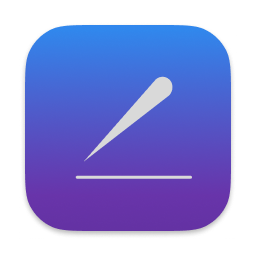

  

<h1 align="center">Xiezi</h1>

This is a refactored version of the app [duoshao](https://github.com/shigedangao/duoshao) by using Swift-ui.
The UI is roughly the same. But the app is way more snappier and feel more native

## Local dev

- You'll need to compile the Rust binding which can be found [here](https://github.com/shigedangao/xuexie-swifty) by following the README.md
- Once done, you need to add the generated Swift package to the Framework section
- Run build and it should work ! 

## Release build

Release build should be done by using the option `Product > Archive` then export the archive. The archive by default is including both ARM & Intel architecture.

## Install

Download the zip. Unzip and either run the app on the extracted folder or move it to the application folder
